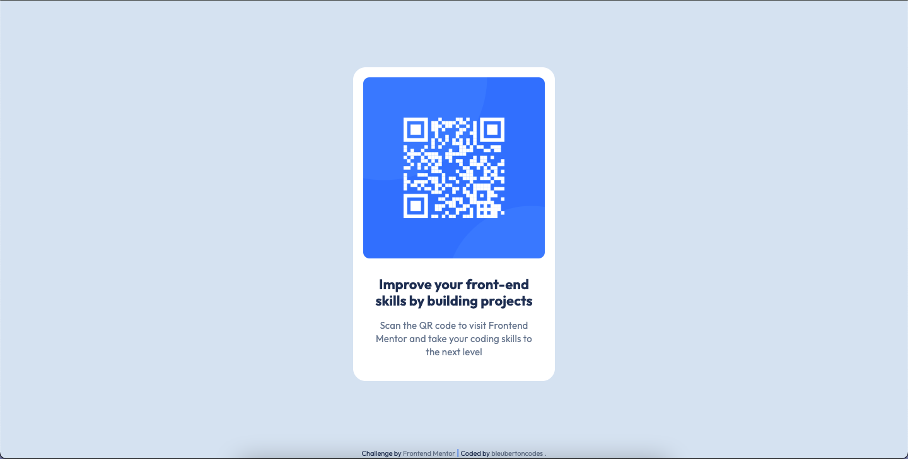

# Frontend Mentor - QR code component solution

This is a solution to the [QR code component challenge on Frontend Mentor](https://www.frontendmentor.io/challenges/qr-code-component-iux_sIO_H). Frontend Mentor challenges help you improve your coding skills by building realistic projects. 

## Table of contents

- [Overview](#overview)
  - [Screenshot](#screenshot)
  - [Links](#links)
- [My process](#my-process)
  - [Built with](#built-with)
  - [What I learned](#what-i-learned)
  - [Continued development](#continued-development)
  - [Useful resources](#useful-resources)
- [Author](#author)


## Overview

### Screenshot





### Links

- Solution URL: [Solution](https://bleubertoncodes.github.io/QR-code-component-Frontend-Mentor/)
- Live Site URL: [Live Site](https://bleubertoncodes.github.io/Frontend-Mentor-QR-code-component/)


## My process

### Built with

- Semantic HTML5 markup
- CSS custom properties
- Flexbox


### What I learned

I learned diring this challenge the value of using margin to align elements.


```css
.qr-card-container {
  margin: auto;
}
```


### Continued development
This is the first challenge that I have completed without any guidance. This really helped combine all of the things I have been learning. The biggest challenge I faced was knowing when to us Flexbox vs. when to use Margin to align certain elements. Being comfortable and very familiar with layouts using CSS will greatly increase my grasp of these concepts and solidify my skills using them. Practice!


### Useful resources

- [Margin to align elements](https://developer.mozilla.org/en-US/docs/Web/CSS/margin) - This helped me grasp the concept of how to align elements using 'margin: auto;'. I realized that sometimes it is easier to use 'margin: auto;' to align the main content  elements than using Flexbox.


## Author

- Frontend Mentor - [@bleubertoncodes.](https://www.frontendmentor.io/profile/bleubertoncodes)
- Twitter - [@bleubertoncodes](https://www.twitter.com/bleubertoncodes)


